<div align="center">

# Reach AI

### Agentic Influencer Marketing Platform

_From deep lead discovery to hyper-personalized outreach — fully automated._

[](https://python.org)
[](https://langchain-ai.github.io/langgraph/)
[](https://nextjs.org)
[](https://ai.google.dev/)

</div>

---

## Overview

**Reach AI** is an end-to-end agentic platform that automates the influencer marketing funnel. It replaces manual spreadsheet scouting with an intelligent LangGraph pipeline that discovers, qualifies, and ranks influencers — using real-time metrics, semantic analysis, and brand-fit & safety analysis.

The platform understands your **actual campaign context** — your brand's industry, price point, target persona, and goals — and uses that understanding to find creators who are a genuine strategic fit, not just names that match a hashtag.

|                     | Traditional Platforms (Modash, Upfluence, etc.)                        | Reach AI                                                                                                                                                |
| ------------------- | ---------------------------------------------------------------------- | ------------------------------------------------------------------------------------------------------------------------------------------------------- |
| **Discovery**       | Browse a static database filtered by tags, category, or follower count | AI reads your full campaign brief and generates dozens of strategic search queries — finds creators by _what they actually talk about_, not just labels |
| **Evaluation**      | Surface-level metrics: followers, avg likes, engagement %              | Deep performance intelligence: fair-price valuation, consistency scores, trust analysis, expected ROI per video                                         |
| **Brand Safety**    | Little to no safety screening                                          | Real-time risk detection — automatically flags dead channels, fake engagement, and underperforming creators                                             |
| **Ranking Logic**   | Hidden algorithm or basic sorting by follower count                    | Every creator comes with a **written explanation** of why they ranked where they did — fully transparent, no black box                                  |
| **Brand Fit**       | Keyword/tag matching (e.g., "fitness", "tech")                         | Understands your campaign _context_ — your price point, audience pain points, and goals — then matches creators on strategic relevance                  |
| **Pricing Insight** | Generic rate cards or no pricing data                                  | Per-creator valuation adjusted for industry, geography, and actual video performance                                                                    |

---

## Core Features

### 🔍 Deep Campaign-Aware Discovery

Reach AI doesn't just search for your industry name. It reads your full campaign brief — brand, product, audience pain points, price tier — and generates **dozens of strategic search queries** across four dimensions: topic niches, audience struggles, community slang, and video formats. This surfaces creators that manual keyword searches would never find.

### 📊 Performance Intelligence — Metrics That Actually Matter

Forget vanity metrics. Reach AI calculates the numbers a brand **actually needs** before writing a check:

| Metric                      | What it tells you                                                                                                     |
| --------------------------- | --------------------------------------------------------------------------------------------------------------------- |
| **Creator Valuation**       | How much a sponsorship with this creator should realistically cost, adjusted for their industry and geography         |
| **Estimated Ad Cost (CPM)** | What you can expect to pay per 1,000 views, calibrated by niche (FinTech is costlier than Gaming) and audience region |
| **Trust Score**             | Are the creator's followers actually engaged, or just passive? Measures how much the audience _talks back_            |
| **Consistency Score**       | Does this creator hit reliable view counts, or are they a one-hit wonder? Flags volatile, unpredictable channels      |
| **Engagement Rate**         | Real interaction depth — not just subscriber count, but how actively the audience responds                            |
| **Expected Clicks**         | Projected clicks per sponsored video based on industry-specific click-through benchmarks                              |

### 🛡️ Real-Time Risk & Safety Detection

Before a creator ever reaches your shortlist, Reach AI automatically filters out:

- **Dead channels** — Creators who haven't uploaded in 6+ months
- **Zombie engagement** — Channels with suspiciously low interaction relative to their subscriber count
- **Underperforming creators** — Channels that don't meet the minimum view threshold for your industry and price tier
- **Geo mismatches** — Creators whose audience country doesn't align with your target market

### � Brand-Fit Ranking — Not a Black Box

Most tools rank creators by subscriber count or a hidden score. Reach AI is different. An AI strategist evaluates each creator on **actual content relevance** to your brand — looking at their recent videos, channel description, and niche positioning — completely independent of their metrics. Every creator in your final list comes with a **written reasoning** explaining exactly why they're a strategic fit for your campaign.

### 📋 Transparent Deal Recommendations

Every creator gets a clear deal status: **Strong Buy**, **Consider**, or **Avoid** — along with a full score breakdown showing the strategy score, health score, and risk assessment. No guesswork, no hidden logic.

### 🌓 Light & Dark Mode

A premium, dashboard-centric frontend with system-aware theme switching for a clean, professional experience.

---

## System Architecture

The backend is a **linear LangGraph StateGraph** with 8 nodes, each with automatic retry policies and in-memory caching.

```mermaid
graph LR
    START((START)) --> A[Campaign<br/>Understanding]
    A --> B[Keyword<br/>Generator]
    B --> C[YouTube<br/>Search Gate]
    C --> D[Subscriber<br/>Filter]
    D --> E[Channel<br/>Enrichment]
    E --> F[Semantic<br/>Processor]
    F --> G[LLM<br/>Reranker]
    G --> H[Final<br/>Scoring]
    H --> END((END))

    style START fill:#10b981,stroke:#059669,color:#fff
    style END fill:#ef4444,stroke:#dc2626,color:#fff
    style A fill:#6366f1,stroke:#4f46e5,color:#fff
    style B fill:#6366f1,stroke:#4f46e5,color:#fff
    style C fill:#f59e0b,stroke:#d97706,color:#fff
    style D fill:#f59e0b,stroke:#d97706,color:#fff
    style E fill:#f59e0b,stroke:#d97706,color:#fff
    style F fill:#8b5cf6,stroke:#7c3aed,color:#fff
    style G fill:#8b5cf6,stroke:#7c3aed,color:#fff
    style H fill:#ec4899,stroke:#db2777,color:#fff
```



### Node Breakdown

| #   | Node                     | Type    | Purpose                                                                           |
| --- | ------------------------ | ------- | --------------------------------------------------------------------------------- |
| 1   | `campaign_understanding` | 🧠 LLM  | Expands brand brief into strategic topics, formats, pain points, and safety level |
| 2   | `keyword_generator`      | 🧠 LLM  | Translates strategy into 4 categories of native YouTube search queries            |
| 3   | `youtube_search_gate`    | 🌐 API  | Async-concurrent YouTube search across top 10 keywords (semaphore-limited)        |
| 4   | `subscriber_filter`      | 🌐 API  | Batch filters by subscriber count, country, and minimum content health            |
| 5   | `channel_enrichment`     | 🌐 API  | Fetches recent videos, calculates metrics, validates health, extracts socials     |
| 6   | `semantic_processor`     | 🧮 Math | Hybrid BM25 + Gemini embedding cosine similarity (70/30 vector/keyword blend)     |
| 7   | `reranker_node`          | 🧠 LLM  | Batched async LLM judge scoring brand-fit relevance (0–100)                       |
| 8   | `final_scoring_node`     | 🧮 Math | Weighted fusion of LLM score + health metrics with risk penalty                   |

### State Schema

The pipeline uses a progressive enrichment pattern — each node extends the channel data model:

```
ChannelData → EnrichedChannel → AnalyzedChannel → RankedChannel → FinalScoredChannel
```

All state is managed via `Pydantic` models and `TypedDict` classes in `backend/my_agent/utils/state.py`.

---

## Project Structure

```
ReachAi-InfluencerMarketing/
│
├── backend/
│   ├── main.py                  # FastAPI entry point (WIP)
│   ├── requirements.txt         # Python dependencies
│   ├── langgraph.json           # LangGraph deployment config
│   │
│   ├── core/
│   │   ├── model.py             # Gemini 2.5 Flash initialization
│   │   └── get_youtube_client.py
│   │
│   ├── my_agent/
│   │   ├── agent.py             # Graph definition & compilation
│   │   ├── utils/
│   │   │   └── state.py         # Pydantic state schema
│   │   └── nodes/
│   │       ├── campaign_understanding.py
│   │       ├── keyword_generator.py
│   │       ├── youtube_search_gate.py
│   │       ├── subscriber_filter.py
│   │       ├── channel_enrichment.py
│   │       ├── semantic_processor.py
│   │       ├── reranker_node.py
│   │       └── final_scoring_node.py
│   │
│   ├── api/
│   │   └── routes.py
│   └── scripts/
│
├── frontend/
│   ├── app/
│   │   ├── layout.tsx           # Root layout with ThemeProvider
│   │   ├── page.tsx             # Dashboard — BrandDetails, Campaign, Audience, Constraints
│   │   ├── globals.css
│   │   └── _components/         # Page-level form sections
│   │
│   ├── components/
│   │   ├── ui/                  # Radix-based primitives (Badge, Button, Dialog, etc.)
│   │   ├── kibo-ui/             # Status indicators
│   │   ├── theme-provider.tsx   # next-themes wrapper
│   │   ├── CampaignGoal.tsx
│   │   ├── CreatorAuthority.tsx
│   │   ├── SearchAndSelectInput.tsx
│   │   ├── RangeSlider.tsx
│   │   └── ...
│   │
│   ├── data/                    # Static ontologies & datasets
│   ├── hooks/                   # Custom React hooks
│   ├── lib/                     # Utility functions
│   └── public/                  # Static assets
│
└── .gitignore
```

---

## Installation

### Prerequisites

- **Python** 3.11+
- **Node.js** 20+
- **npm** 10+
- A [Google Cloud](https://console.cloud.google.com/) project with YouTube Data API v3 enabled
- A [Google AI Studio](https://aistudio.google.com/) API key for Gemini

### Backend Setup

```bash
# Navigate to the backend directory
cd backend

# Create and activate a virtual environment
python -m venv .venv
source .venv/bin/activate    # macOS/Linux
# .venv\Scripts\activate     # Windows

# Install dependencies
pip install -r requirements.txt

# Configure environment variables (see section below)
cp .env.example .env
```

### Frontend Setup

```bash
# Navigate to the frontend directory
cd frontend

# Install dependencies
npm install

# Start the development server
npm run dev
```

The frontend will be available at `http://localhost:3000`.

---

## API Configuration

Create a `.env` file in the `backend/` directory with the following keys:

| Variable          | Description                               | Required |
| ----------------- | ----------------------------------------- | -------- |
| `GOOGLE_API_KEY`  | Google AI Studio key for Gemini 2.5 Flash | ✅       |
| `YOUTUBE_API_KEY` | YouTube Data API v3 key                   | ✅       |
| `APIFY_API_TOKEN` | Apify client token (for social scraping)  | Optional |

```env
GOOGLE_API_KEY=your_gemini_api_key
YOUTUBE_API_KEY=your_youtube_data_api_key
APIFY_API_TOKEN=your_apify_token
```

> [!IMPORTANT]
> The YouTube Data API has a daily quota of **10,000 units**. Each search query costs ~100 units. Running the full pipeline with 10 keywords consumes ~1,000 units from search alone, plus additional units for channel and video detail fetches. Monitor your usage in the [Google Cloud Console](https://console.cloud.google.com/apis/dashboard).

---

## Tech Stack

| Layer             | Technology              | Role                                                           |
| ----------------- | ----------------------- | -------------------------------------------------------------- |
| **Orchestration** | LangGraph               | Agentic StateGraph with retry policies, caching, checkpointing |
| **AI / LLM**      | Google Gemini 2.5 Flash | Campaign strategy, keyword gen, brand-fit reranking            |
| **Embeddings**    | Gemini Embedding 001    | Semantic similarity for channel matching                       |
| **Search**        | BM25Okapi (rank-bm25)   | Keyword relevance scoring                                      |
| **Data**          | YouTube Data API v3     | Channel stats, video metadata, playlist data                   |
| **State**         | Pydantic + TypedDict    | Strongly-typed pipeline state management                       |
| **Frontend**      | Next.js 16 / React 19   | Dashboard UI with server components                            |
| **Styling**       | Tailwind CSS v4         | Utility-first responsive design                                |
| **Animation**     | Framer Motion           | Micro-interactions and transitions                             |
| **Theming**       | next-themes             | System-aware light/dark mode switching                         |

---

## Roadmap

- [ ] **FastAPI Integration** — Expose the LangGraph pipeline via REST endpoints
- [ ] **Agentic Outreach Subgraph** — LangGraph-driven email drafting with creator-specific personalization
- [ ] **Human-in-the-Loop Review Gate** — Interrupt-based approval flow before outreach goes live
- [ ] **Results Dashboard** — Visual display of ranked creators with score breakdowns
- [ ] **Multi-Platform Support** — Extend beyond YouTube to Instagram, TikTok, and X
- [ ] **Campaign History** — Persistent storage with PostgreSQL for past runs and A/B comparison
- [ ] **Export & CRM Sync** — CSV/JSON export and direct CRM integration (HubSpot, Salesforce)
- [ ] **Real-Time Streaming** — LangGraph event streaming for live pipeline progress in the UI

---

<div align="center">

Built by [Srijan Patel](https://github.com/Srijan76-code)

</div>
