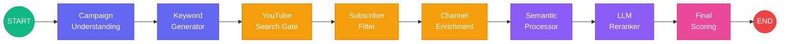

<div align="center">
  <br>
  <h1>R E A C H &nbsp; A I</h1>
  <p>
    <b>End-to-End Influencer Marketing Automation</b>
  </p>
  <p>
    <sub>
      From deep lead discovery to hyper-personalized outreach — fully automated.
    </sub>
  </p>
  <br>
  <p>
    
    
    
    
  </p>

  <br>
  <a href="#-project-overview">Project Overview</a> ✦
  <a href="#-core-features">Key Features</a> ✦
  <a href="#-traditional-platforms-vs-reach-ai">Comparison</a> ✦
  <a href="#-system-architecture">Architecture</a> ✦
  <a href="#-project-structure">Structure</a> ✦
  <a href="#-installation">Installation</a> ✦
  <a href="#-api-configuration">API</a> ✦
  <a href="#-tech-stack">Tech Stack</a>
  <br>
</div>

<hr>

## ◈ Project Overview

**Reach AI** is an end-to-end agentic platform that automates the influencer marketing funnel. It replaces manual spreadsheet scouting with an intelligent LangGraph pipeline that discovers, qualifies, and ranks influencers — using real-time metrics, semantic analysis, and brand-fit & safety analysis.

The platform understands your **actual campaign context** — your brand's industry, price point, target persona, and goals — and uses that understanding to find creators who are a genuine strategic fit, not just names that match a hashtag.

<br>

## ◈ Core Features

### Core Capabilities

| <kbd>01</kbd> Deep Campaign-Aware Discovery                                                                                                                                  | <kbd>02</kbd> Brand-Fit Ranking                                                                                                                 |
| :------------------------------------------------------------------------------------------------------------------------------------------------------------ | :----------------------------------------------------------------------------------------------------------------------------------------------- |
| Reads your full campaign brief and generates dozens of strategic search queries across niches, audience struggles, and formats to surface creators manual searches miss. | Evaluates each creator on actual content relevance to your brand, independent of metrics, with a written reasoning explaining exactly why they're a fit. |

| <kbd>03</kbd> Performance Intelligence                                                                                                                                 | <kbd>04</kbd> Real-Time Risk Detection                                                                                                                        |
| :--------------------------------------------------------------------------------------------------------------------------------------------------------- | :--------------------------------------------------------------------------------------------------------------------------------------------- |
| Metrics that matter: Fair valuation, estimated CPM, trust scores, consistency, and expected link clicks per video based on industry-specific benchmarks. | Automatically filters out dead channels, zombie engagement, geo-mismatches, and channels not meeting your view thresholds. |

<br>

## ◈ Traditional Platforms vs Reach AI

| Domain             | Traditional Platforms (Modash, Upfluence)                             | Reach AI                                     |
| :----------------- | :------------------------------------------------ | :------------------------------------------- |
| **Discovery**      | Browse static database filtered by tags, category | AI generates strategic queries to find what creators *actually* talk about     |
| **Evaluation**     | Surface-level: followers, avg likes              | Deep: fair-price valuation, consistency, expected ROI per video  |
| **Brand Safety**   | Little to no safety screening        | Real-time risk detection (flags dead channels, fake engagement)          |
| **Ranking**        | Hidden algorithm or basic sorting by follower count  | Every creator has a written explanation of their strategic relevance |
| **Pricing**        | Generic rate cards or no pricing data  | Per-creator valuation adjusted for industry, geo, and actual performance |

<br>

## ◈ System Architecture

The backend is a **linear LangGraph StateGraph** with 8 nodes, each with automatic retry policies and in-memory caching.


```mermaid
graph LR
    START((START)) --> A[Campaign<br/>Understanding]
    A --> B[Keyword<br/>Generator]
    B --> C[YouTube<br/>Search Gate]
    C --> D[Subscriber<br/>Filter]
    D --> E[Channel<br/>Enrichment]
    E --> F[Semantic<br/>Processor]
    F --> G[LLM<br/>Reranker]
    G --> H[Final<br/>Scoring]
    H --> END((END))

    style START fill:#10b981,stroke:#059669,color:#fff
    style END fill:#ef4444,stroke:#dc2626,color:#fff
    style A fill:#6366f1,stroke:#4f46e5,color:#fff
    style B fill:#6366f1,stroke:#4f46e5,color:#fff
    style C fill:#f59e0b,stroke:#d97706,color:#fff
    style D fill:#f59e0b,stroke:#d97706,color:#fff
    style E fill:#f59e0b,stroke:#d97706,color:#fff
    style F fill:#8b5cf6,stroke:#7c3aed,color:#fff
    style G fill:#8b5cf6,stroke:#7c3aed,color:#fff
    style H fill:#ec4899,stroke:#db2777,color:#fff
```

<br>

## ◈ Project Structure

```text
/
├── backend/
│   ├── main.py                  — FastAPI entry point (WIP)
│   ├── my_agent/                — Core LangGraph node processing and ranking logic
│   └── scripts/                 — CLI utilities
├── frontend/
│   ├── app/                     — Next.js React Dashboard and UI components
│   └── data/                    — Static ontologies & datasets
```

<br>

## ◈ Installation

**Prerequisites:** Python 3.11+, Node.js 20+, Google Cloud Project (YouTube Data API v3), Google AI Studio Key.

<details>
<summary><b>Quick Setup</b></summary>

<br>

**1. Backend Setup**

```bash
cd backend
python -m venv .venv
source .venv/bin/activate
pip install -r requirements.txt
cp .env.example .env
```

**2. Frontend Setup**

```bash
cd frontend
npm install
npm run dev
```

</details>

<br>

## ◈ API Configuration

Create a `.env` file in the `backend/` directory:

| Variable          | Description                               | Required |
| ----------------- | ----------------------------------------- | -------- |
| `GOOGLE_API_KEY`  | Google AI Studio key for Gemini 2.5 Flash | ✅       |
| `YOUTUBE_API_KEY` | YouTube Data API v3 key                   | ✅       |
| `APIFY_API_TOKEN` | Apify client token (for social scraping)  | Optional |

> [!IMPORTANT]
> The YouTube Data API has a daily quota of **10,000 units**. Each search query costs ~100 units. Running the full pipeline with 10 keywords consumes ~1,000 units from search alone, plus additional units for channel and video detail fetches. Monitor your usage in the Google Cloud Console.

<br>

## ◈ Tech Stack

| Domain          | Technology          | Implementation Objective                                             |
| :-------------- | :------------------ | :------------------------------------------------------------------- |
| **Frontend**    | Next.js & Tailwind  | Delivering a premium, dark-themed, data-dense React interface.       |
| **Backend**     | Python & FastAPI    | LangGraph orchestration and semantic search algorithms.    |
| **AI Engine**   | Gemini 2.5 Flash    | Campaign strategy, keyword gen, brand-fit reranking.    |
| **Type Safety** | TypeScript/Pydantic | Structuring rigid data contracts across the pipeline.                |

<br>

---

<div align="center">
  <i>Built by <a href="https://github.com/Srijan76-code">Srijan Patel</a></i>
</div>
